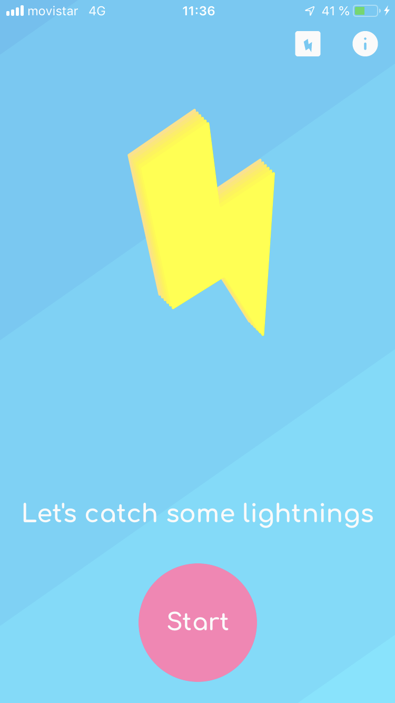
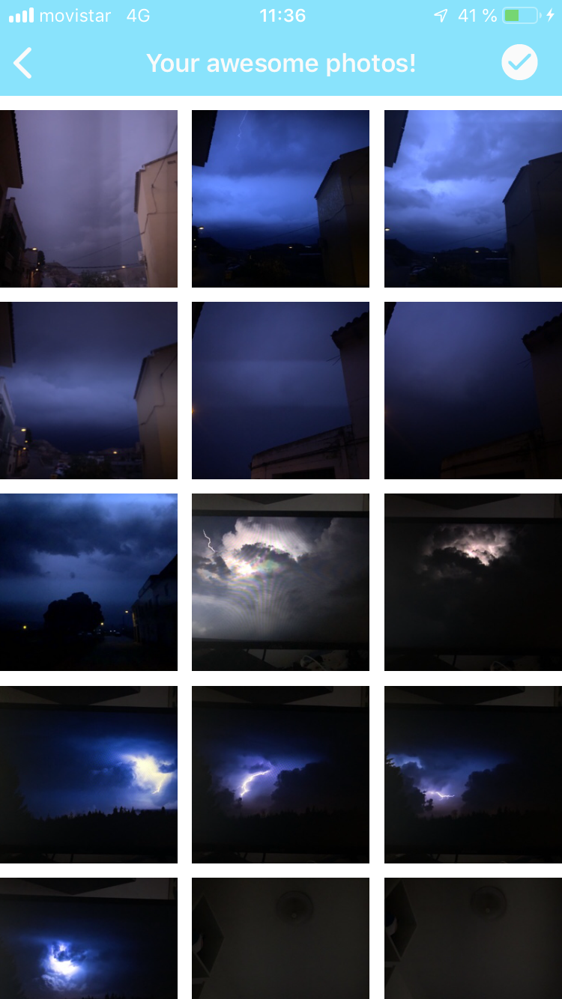
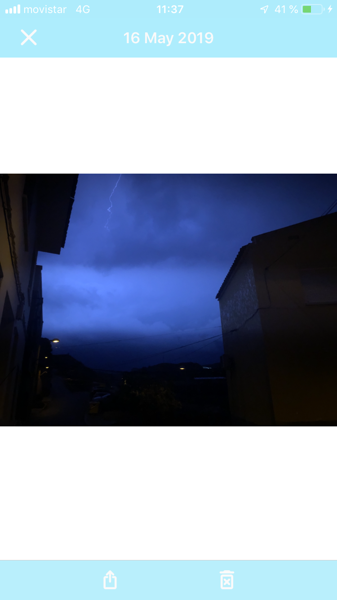
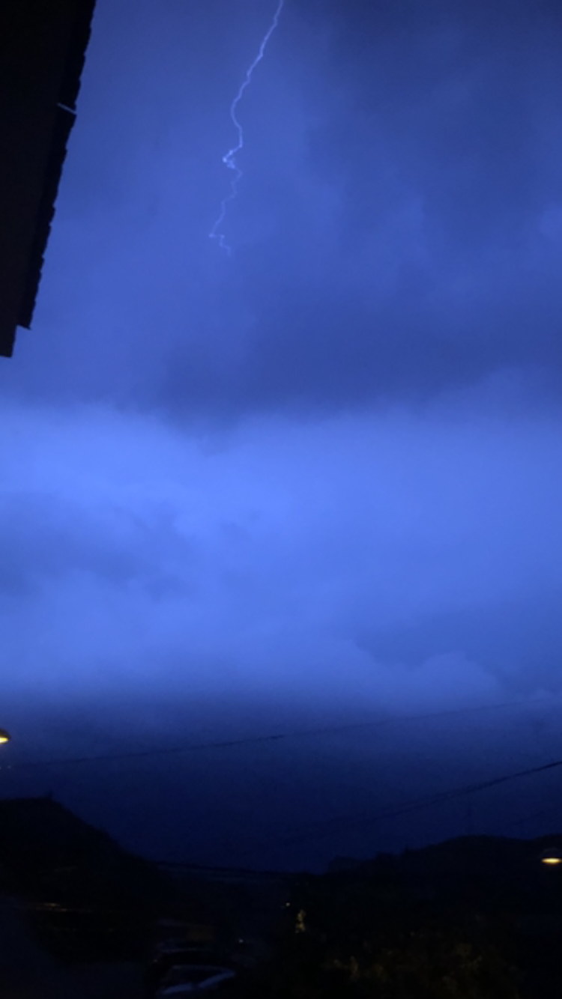

<h1>Thundy</h1>
<h2>IOS (Swift)</h2>
<b>Main tools</b>
<ul>
<li>Camera API</li>
<li>Custom Transitions</li>
<li>Gallery</li>
</ul>

<h1>Description</h1>

Thundy helps users to take amazing lightning photos automatically

Thundy scans and analyze the brightness of a scene in order to find fluctuations, such as the ones produced by a flashing light or a lighting

This app started as an academic/personal app, but has grown and now is waiting for be published in the app store

<h1>Screenshots</h1>

  
  

  
  

<h1>Videos</h1>

  
  

<h1>License</h1>

This repo acts like a portfolio and the app contained here <b>can't hold liability neither place warranty</b>. Furthermore, Thundy is meant to be a commercial app published in the app store, so in order to avoid problems in the future this repo has a <b>NonCommercial</b> CC-BY-NC license

 This work is licensed under a <a rel="license" href="http://creativecommons.org/licenses/by-nc-nd/4.0/">Creative Commons Attribution-NonCommercial-NoDerivatives 4.0 International License</a>.
